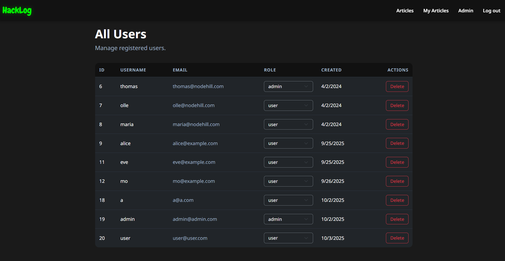

# 🚀 HackLog - Cybersecurity Knowledge Platform

A modern web application for sharing cybersecurity articles with role-based access control.

## ✨ Features
- **Authentication**: Login/Register with role-based permissions
- **Articles**: Create, edit, delete articles with tags
- **Search**: Full-text search and tag filtering
- **Admin Panel**: User and content management
- **Modern UI**: Dark theme with responsive design

## 🛠 Tech Stack
- **Frontend**: React + TypeScript + Bootstrap
- **Backend**: .NET 8 Core API
- **Database**: SQLite with views

## 📸 Screenshots

 ## Landing page with hero section
 

 
## Article listing with filters
|  |  |
|:---:|:---:|

## Admin panel

|  |  |
|:---:|:---:|

## 🔑 Test Credentials
- **Admin**: `admin@admin.com` / `admin`
- **User**: `user@user.com` / `user`

